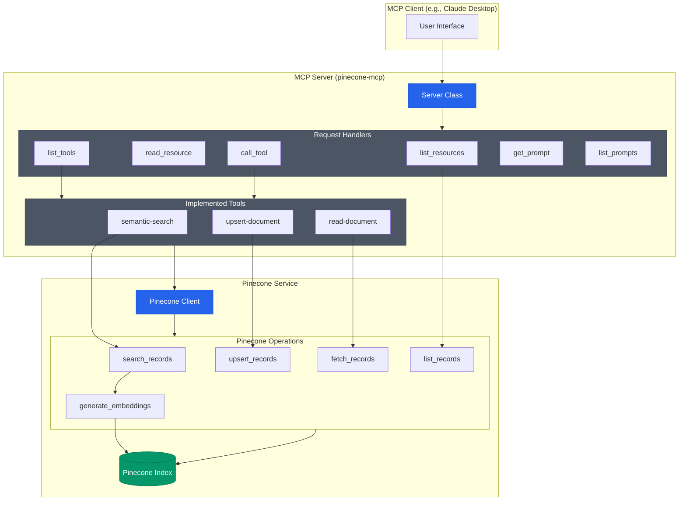

# Pinecone Model Context Protocol Server for Claude Desktop.

Read and write to a Pinecone index.


## Components



### Resources

The server implements the ability to read and write to a Pinecone index.

### Tools

- `semantic-search`: Search for records in the Pinecone index.
- `read-document`: Read a document from the Pinecone index.
- `upsert-document`: Upsert a document into the Pinecone index.
- `process-document`: Process a document into chunks and upsert them into the Pinecone index. This performs the overall steps of chunking, embedding, and upserting.
- `chunk-document`: Chunk a document into chunks.
- `embed-document`: Generate embeddings for a document using Pinecone's inference API.

Note: embeddings are generated via Pinecone's inference API and chunking is done with a rudimentary markdown splitter (via `langchain`).
## Quickstart

### Install the server

Recommend using [uv](https://docs.astral.sh/uv/getting-started/installation/) to install the server locally for Claude.

```
uvx install mcp-pinecone
```
OR
```
uv pip install mcp-pinecone
```

Add your config as described below.

#### Claude Desktop

On MacOS: `~/Library/Application\ Support/Claude/claude_desktop_config.json`
On Windows: `%APPDATA%/Claude/claude_desktop_config.json`

Note: You might need to use the direct path to `uv`. Use `which uv` to find the path.


__Development/Unpublished Servers Configuration__
  
```json
"mcpServers": {
  "mcp-pinecone": {
    "command": "uv",
    "args": [
      "--directory",
      "{project_dir}",
      "run",
      "mcp-pinecone"
    ]
  }
}
```


__Published Servers Configuration__
  
```json
"mcpServers": {
  "mcp-pinecone": {
    "command": "uvx",
    "args": [
      "--index-name",
      "{your-index-name}",
      "--api-key",
      "{your-secret-api-key}",
      "mcp-pinecone"
    ]
  }
}
```

#### Sign up to Pinecone

You can sign up for a Pinecone account [here](https://www.pinecone.io/).

#### Get an API key

Create a new index in Pinecone, replacing `{your-index-name}` and get an API key from the Pinecone dashboard, replacing `{your-secret-api-key}` in the config.

## Development

### Building and Publishing

To prepare the package for distribution:

1. Sync dependencies and update lockfile:
```bash
uv sync
```

2. Build package distributions:
```bash
uv build
```

This will create source and wheel distributions in the `dist/` directory.

3. Publish to PyPI:
```bash
uv publish
```

Note: You'll need to set PyPI credentials via environment variables or command flags:
- Token: `--token` or `UV_PUBLISH_TOKEN`
- Or username/password: `--username`/`UV_PUBLISH_USERNAME` and `--password`/`UV_PUBLISH_PASSWORD`

### Debugging

Since MCP servers run over stdio, debugging can be challenging. For the best debugging
experience, we strongly recommend using the [MCP Inspector](https://github.com/modelcontextprotocol/inspector).


You can launch the MCP Inspector via [`npm`](https://docs.npmjs.com/downloading-and-installing-node-js-and-npm) with this command:

```bash
npx @modelcontextprotocol/inspector uv --directory {project_dir} run mcp-pinecone
```


Upon launching, the Inspector will display a URL that you can access in your browser to begin debugging.

## License

This project is licensed under the MIT License. See the [LICENSE](LICENSE) file for details.

## Source Code

The source code is available on [GitHub](https://github.com/sirmews/mcp-pinecone).

## Contributing

Send your ideas and feedback to me on [Bluesky](https://bsky.app/profile/perfectlycromulent.bsky.social) or by opening an issue.