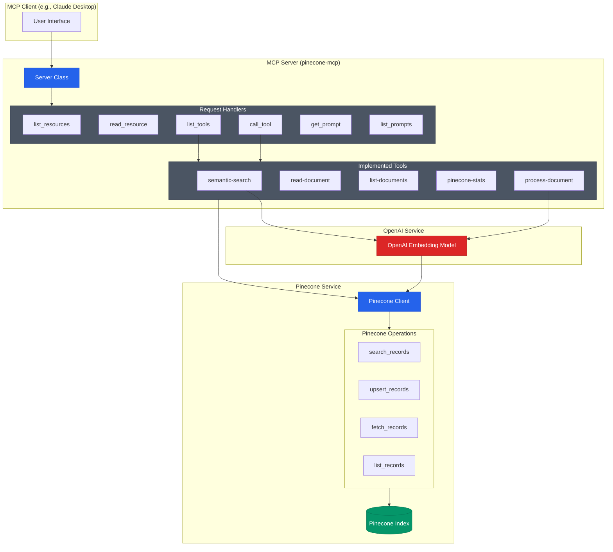

# Pinecone Model Context Protocol Server for Claude Desktop.

[](https://smithery.ai/server/mcp-pinecone)

[](https://pypi.org/project/mcp-pinecone/)

Read and write to a Pinecone index with OpenAI embeddings.

## Features

- **OpenAI Embeddings**: Uses OpenAI's `text-embedding-ada-002` model for generating embeddings
- **Pinecone Integration**: Seamlessly integrates with Pinecone for vector storage and retrieval
- **Semantic Search**: Powerful semantic search capabilities with metadata filtering
- **Document Processing**: Automatic chunking, embedding, and indexing of documents
- **MCP Protocol**: Full Model Context Protocol support for Claude Desktop

## Quick Start

### 1. 克隆项目
```bash
git clone <repository-url>
cd mcp-pinecone
```

### 2. 设置虚拟环境（推荐）

**macOS/Linux:**
```bash
chmod +x setup_venv.sh
./setup_venv.sh
```

**Windows:**
```cmd
setup_venv.bat
```

**手动设置:**
```bash
# 安装 uv
curl -LsSf https://astral.sh/uv/install.sh | sh

# 创建虚拟环境并安装依赖
uv sync

# 激活虚拟环境
source .venv/bin/activate  # macOS/Linux
# 或
.venv\Scripts\activate     # Windows
```

### 3. 配置环境变量
编辑 `.env` 文件：
```bash
OPENAI_API_KEY=your_openai_api_key_here
PINECONE_API_KEY=your_pinecone_api_key_here
PINECONE_INDEX_NAME=mcp-pinecone-index
```

### 4. 测试安装
```bash
python test_openai_embedding.py
```

### 5. 运行示例
```bash
python example_usage.py
```

### 6. 测试查询功能
```bash
# 快速查询测试（不插入数据）
python test_query_only.py

# 详细查询测试
python test_openai_embedding.py

# 交互式查询测试
python interactive_query.py
```

## Components



### Resources

The server implements the ability to read and write to a Pinecone index using OpenAI embeddings.

### Tools

- `semantic-search`: Search for records in the Pinecone index using OpenAI embeddings.
- `read-document`: Read a document from the Pinecone index.
- `list-documents`: List all documents in the Pinecone index.
- `pinecone-stats`: Get stats about the Pinecone index, including the number of records, dimensions, and namespaces.
- `process-document`: Process a document into chunks, generate embeddings using OpenAI, and upsert them into the Pinecone index.

Note: Embeddings are generated via OpenAI's `text-embedding-ada-002` model and chunking is done with a token-based chunker.

## Quickstart

### Prerequisites

1. **OpenAI API Key**: Get your API key from [OpenAI Platform](https://platform.openai.com/api-keys)
2. **Pinecone Account**: Sign up for a Pinecone account [here](https://www.pinecone.io/)
3. **Pinecone API Key**: Create a new index in Pinecone and get your API key

### Environment Setup

Create a `.env` file in your project directory:

```bash
# OpenAI API Configuration
OPENAI_API_KEY=your_openai_api_key_here

# Pinecone Configuration
PINECONE_API_KEY=your_pinecone_api_key_here
PINECONE_INDEX_NAME=mcp-pinecone-index
```

### Installing via Smithery

To install Pinecone MCP Server for Claude Desktop automatically via [Smithery](https://smithery.ai/server/mcp-pinecone):

```bash
npx -y @smithery/cli install mcp-pinecone --client claude
```

### Install the server

Recommend using [uv](https://docs.astral.sh/uv/getting-started/installation/) to install the server locally for Claude.

```
uvx install mcp-pinecone
```
OR
```
uv pip install mcp-pinecone
```

Add your config as described below.

#### Claude Desktop

On MacOS: `~/Library/Application\ Support/Claude/claude_desktop_config.json`
On Windows: `%APPDATA%/Claude/claude_desktop_config.json`

Note: You might need to use the direct path to `uv`. Use `which uv` to find the path.

__Development/Unpublished Servers Configuration__
  
```json
"mcpServers": {
  "mcp-pinecone": {
    "command": "uv",
    "args": [
      "--directory",
      "{project_dir}",
      "run",
      "mcp-pinecone"
    ]
  }
}
```

__Published Servers Configuration__
  
```json
"mcpServers": {
  "mcp-pinecone": {
    "command": "uvx",
    "args": [
      "--index-name",
      "{your-index-name}",
      "--api-key",
      "{your-secret-api-key}",
      "mcp-pinecone"
    ]
  }
}
```

## OpenAI Embedding Integration

This project now supports OpenAI embeddings instead of Pinecone's inference API. Key benefits:

- **Better Quality**: OpenAI's `text-embedding-ada-002` model provides high-quality embeddings
- **Consistent Performance**: Reliable embedding generation with OpenAI's robust API
- **Flexible Usage**: Support for both text queries and pre-computed embedding vectors

### Setup for OpenAI Integration

1. **Install Dependencies**:
   ```bash
   pip install openai llama-index-embeddings-openai
   ```

2. **Set Environment Variables**:
   ```bash
   export OPENAI_API_KEY=your_openai_api_key_here
   export PINECONE_API_KEY=your_pinecone_api_key_here
   ```

3. **Test Integration**:
   ```bash
   python test_openai_embedding.py
   ```

### Usage Examples

```python
from src.mcp_pinecone.pinecone import PineconeClient, PineconeRecord

# Initialize client with OpenAI embeddings
client = PineconeClient()

# Generate embeddings
text = "This is a sample document"
embeddings = client.generate_embeddings(text)

# Create and upsert record
record = PineconeRecord(
    id="doc-001",
    embedding=embeddings,
    text=text,
    metadata={"source": "sample"}
)
client.upsert_records([record])

# Search using text query
results = client.search_records("sample document", top_k=5)
```

For more examples, see `example_usage.py` and `OPENAI_EMBEDDING_README.md`.

## Development

### Building and Publishing

To prepare the package for distribution:

1. Sync dependencies and update lockfile:
```bash
uv sync
```

2. Build package distributions:
```bash
uv build
```

This will create source and wheel distributions in the `dist/` directory.

3. Publish to PyPI:
```bash
uv publish
```

Note: You'll need to set PyPI credentials via environment variables or command flags:
- Token: `--token` or `UV_PUBLISH_TOKEN`
- Or username/password: `--username`/`UV_PUBLISH_USERNAME` and `--password`/`UV_PUBLISH_PASSWORD`

### Debugging

Since MCP servers run over stdio, debugging can be challenging. For the best debugging
experience, we strongly recommend using the [MCP Inspector](https://github.com/modelcontextprotocol/inspector).


You can launch the MCP Inspector via [`npm`](https://docs.npmjs.com/downloading-and-installing-node-js-and-npm) with this command:

```bash
npx @modelcontextprotocol/inspector uv --directory {project_dir} run mcp-pinecone
```


Upon launching, the Inspector will display a URL that you can access in your browser to begin debugging.

## License

This project is licensed under the MIT License. See the [LICENSE](LICENSE) file for details.

## Source Code

The source code is available on [GitHub](https://github.com/sirmews/mcp-pinecone).

## Contributing

Send your ideas and feedback to me on [Bluesky](https://bsky.app/profile/perfectlycromulent.bsky.social) or by opening an issue.
